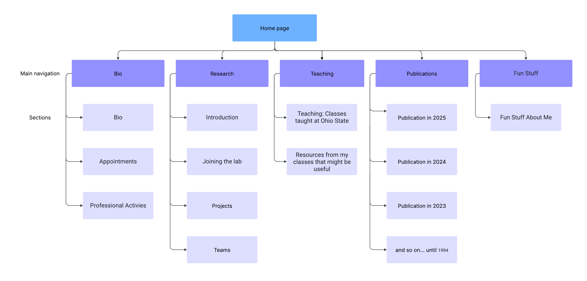

# Project-4-MasterRubyInsane

# Description
Project Overview: Redesign and implement a brand-new static website for Prof. Eric Fosler-Lussier, enhancing its visual appeal, maintainability, and adherence to modern web standards. Original Site: https://efosler.github.io/

# Managers
Overall Project Manager: Oliver Shen  
Meeting Manager: Sam Cubberly
# Site Map

# Meeting Reports
**Meeting 1: 6/22**
1. Members Present: Sam Cubberly, Anshuman Ranjan, Oliver Shen, Yunfeng Wang
2. Goals:  
	-Sam Cubberly: Goals to distribute yml, erb, and css files evenly. Wanted to ensure that by Wednesday we had the proejct done except for testing.  
	-Oliver Shen: Give each person 1 page, divide the 6 sections between 4 people.  
	-Yunfeng Wang: Get the first sprint done very descriptively.  
	-Anshuman Ranjan: Divide the sprints evenly, ensure everyone understands.  
3. Meeting Notes:  
    -Everyone decided what they wanted to do for the first 2 sprints.  
	-We all looked over the slides together to make sure everyone understood how middleman worked.  
	-Spent time getting more confident with directory layout and files.  

**Meeting 2: 6/24 Stand Up**
- Members Present: Sam Cubberly, Anshuman Ranjan, Oliver Shen, Yunfeng Wang  
- Goals:
	- We all came into this meeting, which wasn't really a meeting, with the intent to record a standup of all of us presenting our code. We wanted to see how everyone implemented the code, and then make plans to change code.
- Meeting Notes:  
	- Much of the code wasn't tested, as the members did not fully understand the directory layout.
	- Reexamined the directory layout, shared ideas about concepts, like if quotations are necessary in yml files
	- Made sure all data and css were in the right locations
	- Talked about potentially making the webpage more uniform
	- Sprint was only halfway done, so hard to see what everyone had implemeneted exactly

**Meeting 3: 6/26 Stand Up**
- Members Present: Sam Cubberly, Anshuman Ranjan, Oliver Shen, Yunfeng Wang
- Goals:
	- Sam Cubberly - came into the meeting with the intent of asking permission to make a toggle button for the left bio.
	- Anshuman Ranjan - intention to talk about making layout unresponsive to yield.
	- Oliver Shen- came to meeting hoping to talk about next sprint.
	- Yunfeng Wang- came to meeting to get some guidance on what to do for next sprint.
- Meeting Notes:
	- Discussed that we need to be using more advanced css like pseudo-classes and elements
	- Need to be using grids (which we were)
	- Need to make fonts, colors, links, and background all more uniform.
	- Everyone discusses what they've completed, and then each person comes up with an idea for something that they think would be impactful to the project.
		- Sam Cubberly - build a button that shows/hides the left bio banner
		- Anshuman Ranjan - finish fun stuff, and then make sure layout doesn't respond to yield for main page.
		- Oliver Shen - will work on the homepage of the publications
		- Yunfeng Wang - didn't come up with an idea coming into the meeing (was told last minute about meeting because we had called about submitting the night before and he wasn't available, so he didn't have time to prepare.)

# Contributions
- Sam Cubberly:  
	- left_banner_contacts.yml
		- added all of the contact information for the left side of the page
	- teaching.yml
		- added all of the data that'll show in the teaching tab of the website
	- teaching.html.erb
		- Created a 2 divs with many different individual containers inside of them
		- Used embedded ruby code to iterate through the teaching.yml,and to call variables in yml
		- used embedded ruby code to conditionally include descriptions and images
		- utilized the h1-h4 tags, img tag, a tag, p tag, div tag
	- teaching icons in the images section
		- Added these images: convolutiondemo.png, gaussian2d.png, kmeansdemo2.png, 
		- naivebayes.png, pytorchintro.png, functionfitting.png, gaussian.png, 
		- kmeansdemo.png, perceptron.png, svmdemo.png
	- layout.erb
		- Added the toggle button
		- implemented the grid in the main layout
		- Utilized div classes and grid css logic
		- put yield in the right spot on the grid
	- _leftBarContact.html.erb
		- created to list all of the contact information for the professor
		- utilized unbulleted class for list css
		- called variables with erb
	- _toggleButton.erb
		- implemented input with a checkbox to show or not show the left bar
		- implemented label to have two different variations depending on if the menu was open or not
	- leftContact.css
		- Created a class for unbulleted lists
		- used the child selector
	- main.css
		- created maingrid class, using grid to divide the body of the content into 2 columns
		- used the child selector to get all divs to have a specific size inside
		- created leftBarDropdown id for input, which displayed nothing
		- used the general sibling selector to check all siblings after the checked input
		- used :checked pseudo-class to check if the grid should only show the right side, or bio also
		- added background and text color classes
	- teaching.css
		- utilized attribute tags for divs
		- divided up the multi-content-container so that multiple boxes with information can fit inside of it
		- descImage class for images makes sure all images show up well ib the boxes
	- toggleButton.css
		- Used label attributes: margin, display
		- used :checked pseudo-class to see which input button should be displayed
		- used 3 identifiers (toggleButton, openBio, and closeBio)
		- changed text color

- Oliver Shen:  
	- _topbanner.erb
		- Created the top navigation bar partial for all pages
		- Used nav, div, ul/li, and a tags
		- Added logic to highlight the active page using current_page.url == … ? 'active' : ''
	- top_banner.yml
		- Defined all page links under data/top_banner:
		- Keys: home, bio, research, teaching, publications, fun_stuff
	- topbanner
		- Created .top-banner as a sticky grid header to keep the nav fixed and responsive.
		- Styled .tb-left and .tb-right flex areas for consistent padding, font, and hover/active link colors.
	- publication.html.erb
		- Built the Publications page template
		- Iterated over data.publications.categories to group by year
		- Used section, article, h2, ul/li, and a tags
		- Conditional checks for vol, pages, and doi to render extra metadata and DOI links
		- Added a navigation bottom of years which can directed goes to the year you want
	- publications.yml
		- Structured categories: list, each with year: and nested publications: array
		- Each publication: title, authors, journal, volume, pages, doi
	- publication.css
		- Created .black_tag to display publication-type badges with black background and white bold text.
		- Added padding to .publications and styled its h1 for consistent page spacing and a clear title.
		- Created .pub-list rules to remove bullets, set line-height, and style links for a clean publication list.
		- Added .year-nav with fixed, scrollable sidebar and .anchor-offset for unblocked anchor jumps.
	- main.css
		- Added .pub-link to standardize publication links with no underlines and classic blue color across all link states.
		- Created .homepage-flex layout and its child flex rules to organize the Recent News and Useful Stuff sections in a 2:1 column ratio.
	- index.html.erb
		- Created the Publications preview in index.html.erb, using ERB loops to grab the latest 5 entries from data.publications.categories, tag them with .black_tag, and link DOIs via .pub-link.
		- Added the .homepage-flex container to render “Recent News” and “Useful Stuff” side by side, with ERB loops and conditionals for student cards and resource links.

- Anshuman Ranjan: 
	- sitemap.html
		- Converted the group-generated sitemap into an HTML format, and updated its links as we created new pages
	- layout.erb
		- Tags/Ruby used: div, h1, partial, yield, class, title, link, <%, <%=, body. yml.each(hash)
	- bio.html.erb
		- Tags/Ruby used: Class, section, li, h2, div, array.each_with_index, yml.each(hash), yml.array.each
	- fun_stuff.erb
		- Tags/Ruby used: Class, section, h1, h2, p, a, img, yml.each(hash), yml.hash(key), next if condition
	- bio.css
		- Pseudo-element, grid, position, padding, border, shadow, cursor, hover, background, radius, z-index, display, font-weight
	- fun_stuff.css
		- text-align/justify, transition, hover, scale, grid, flex-display, border, shadow
	- main.css
		- font-family, grid
	- stylesheets.yml
		- hash(key, value)
	- professional_activities.yml
		- hash(key, array) --> array(hash) --> hash(key, value)
	- fun_stuff_images.yml
		- hash(key, hash) --> hash(key, value)
	- appointments.yml
		- hash(key, array) --> array(hash) --> hash(key, value)
	- Imported images (/images/funstuff/)
		- added a new image not on the original site (bookcover.jpg)
	Further details on how each contribution is implemented can be seen by reading each file and looking at the nested comments in each file.

- Yunfeng Wang:
	- left_banner_qualifications.yml 
		- define the upper part of the left banner information from the photos to titles
	- left_banner_qualifications.erb
		- Displays professor's photo, name, url, department, and titles in the left banner
	- current_research_students.yml
		- create to include information of current reesarch students for homepage display.
	- ms_bs_graduates.yml
		- create to include information of ms/bs graduate students for hompage display.
	- phd_graduates.yml
		- create to include information of phd graduate students for homepage display purpose.
	- postdocs.yml
		- create to include information of postdoc students for homepage dispaly.
	- research.yml
		- create structured information on the research page.
	- upload user.png and eric.jpg
		- pictures being used in the other sections like left-banner and homepage.
	- layout.css
		- .proferros-photo is the styling for proferrosr's photo at homepage.
		- the other content are created to format the cards from current-research students to ms/bs graduate students.
	- research.html.erb
		- block different sections in research page, inclduing introduction, joining the lab, osu note, and selected papers;
		- osu note is a foldable section, user can click the button osu notes to fold or unfold this section.
		- user can also open the osu note when click joining the lab section.
		- leave a CSS Selector Tester Demo toggle entry at the end of the page, for easy access purpose.
	- research.css
		- selected papers are formated to be presented in the same formatted small blocks.		
	- selectors.css
		- file must be loaded via: <%= stylesheet_link_tag "selectors" %> in the erb file.
		- have a child selector Applies ONLY to 
 elements that are direct children of any element with class "parent-selector"
		- Adjacent Sibling Selector applies to any 
 tag that directly follows an <h3> inside .research-section, useful for controlling spacing or emphasizing a paragraph that comes immediately after a section header.
		- General Sibling Selector selects ALL 
 elements that follow an <h3> (not just the immediate one) in the same .research-section container, regardless of intervening elements.
		- Attribute Selector selects elements with specific attributes, e.g. <a target="_blank">, this allows styling links that open in new tabs differently.
		- Pseudo-Class styling based on user interaction or element state.
		- Pseudo-Element adds decorative content without touching HTML
	- edit index.html.erb 
		- to display the section of Research, sections from Current Research Students to MS BS Graduates of the website
	

# Sprint #1 - Due 6/23 11:59
File List and Member Responsible  
1. Images  
    -Profile Picturs and any we need for our files  
2. Layouts  
	-Top Banner (INCLUDE NAME) Partial File .erb - Oliver  
	    -Professor Name  
		-Tabs for: Home, Bio, Research, Teaching, Publications, Fun Stuff  
	-Left Banner Qualifications Partial File .erb - Yunfeng  
		-Name, Department, image  
		-Links for professor type?  
		-Down to: “Professor by Courtesy of Linguistics, Biomedical Informatics”  
	-Left Banner Contact Partial File .erb - Sam  
		-Office, phone ..  
		-Links of office, phone …  
	-Layout file .erb - Anshuman  
		-Create Head Tag  
		-Title, idk  
		-Create Body Tag  
		-Call Top Banner and Left Banner partials  
		-Yield rest of html  
	-Layout Style Sheet .css  - Everyone  
		-Includes styles for:  
			-Top Banner partial file  
			-Left Banner partial file  
			-Layout file  
3. YML files  
	-Top Banner URL variables .yml - Oliver  
		-Home: home.url  
	-Left Banner Qualifications .yml - Yunfeng  
		-Qualifications  
	-Left Banner Contact .yml - Sam  
		-Information and the links to the information  
		-Syntax Example:  
			-Office: 395k Dreese Lab  
			-Office_Url: https://www.google.com/maps/place/Dreese+Lab…  

# Sprint #2 - Due 6/25 11:59
Individual Files, can add any partial you see fit, discuss before adding a partial that someone else could use  
	-Teaching .erb, .yml AND .css - SAM  
	-Fun Stuff .erb, .yml AND .css - ANSHUMAN    
	-Bio .erb, .yml AND .css - ANSHUMAN  
	-Research .erb, .yml AND .css - YUNFENG  
	-Publication .erb, .yml AND .css - OLIVER  

# Sprint #3 - Due 6/27 11:59
Complete the partial and own pages, then start combine the home page together
- Anshuman
	- Layout: Updating so that homepage doesn’t respond to yield
	- Fun stuff: will be implemented by end of day 6/26
	- Bio page: Is Fully Completed
	- Homepage tags: Contains template for people to fill in code
- Sam
	- Bottom part of left bar
	- Teaching
	-  Main grid / implementing left banner as a menu
- Yunfeng Wang
	- Research
	- Left qualifications
	- Homepage research block
	-  CSS Selector
- Oliver  
	- Header / menu
	- Publications
	- Homepage of Publications

# Sprint #4 - Due 6/28 11:59
This is for the final submission  
1. Everyone need to update the contributions in README.md
2. Remove some files that aren’t being used anymore
3. Make sure the website works good without bugs

